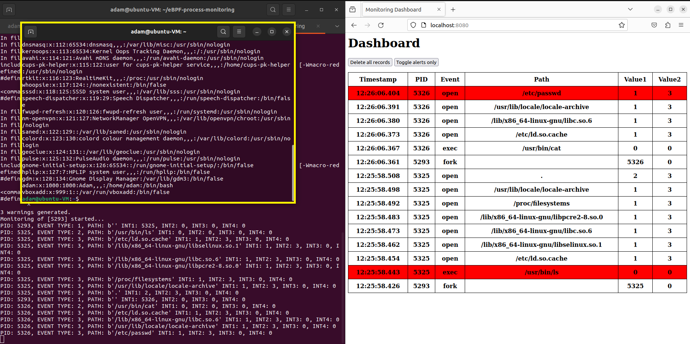

# Process monitoring using eBPF

This project uses an eBPF program to monitor various activities a process (and its children) can do. It uses [BCC](https://github.com/iovisor/bcc) to compile and load the eBPF program. All events are stored in a database and presented on a dashboard (this runs in Docker containers).



(the yellow terminal is the one being tracked)

The development was done on Ubuntu 22.04 (6.2.0-37-generic) and tested also on [Debian12](https://app.vagrantup.com/generic/boxes/debian12) (6.1.0-12-amd64).

# Install guide

Prerequisites:
* [Docker Engine](https://docs.docker.com/engine/install/)
* pip3 to install `python-dotenv`:
  * `pip3 install python-dotenv`

## Install BCC

You should be able to install BCC by running:

```bash
sudo apt update && sudo apt upgrade -y
sudo apt-get install bpfcc-tools linux-headers-$(uname -r)
```

For more details, please refer to the official [BCC install guide](https://github.com/iovisor/bcc/blob/master/INSTALL.md).

## Create .env files

You have to create 2 .env files.

* `./.env`

This configures, where the main program will send events JSONs.

Example content:

```
API_HOST="localhost"
API_PORT="8080"
API_PROXY="/api"
```

---

* `./web-stack/backend/.env`

This configures how the backend reaches the database and also what database is used.

Example content:

```
MONGO_HOST="mongo.local"
MONGO_PORT=27017
DB_NAME="monitoringDb"
```

`MONGO_HOST` is the name of the service running within the docker network.

## Setup script

If you don't want to install everything manually, the `setup.sh` script might help you install all the necessary tools to run the program. It was tested on [Debian 12 (6.1.0-12-amd64) VagrantBox](https://app.vagrantup.com/generic/boxes/debian12).

# Startup

## Rules

The rules that will be used to set colors in the dashboard are managed in `web-stack/backend/config-rules.json`.

```json
{
    "exec": {
        "Allow": [
            "^/usr/bin/cat$",
            "^/usr/bin/head$",
            "^/usr/bin/ls$",
        ]
    },
    "open": {
        "Deny": [
            "^/etc/passwd$",
            "^/etc/shadow$"
        ]
    },
    "connect": {
        "Allow": [
            "127.0.0.1:[0-9]+"
        ]
    },
    "accept": {
        "Allow": [
            "127.0.0.1:[0-9]+"
        ]
    }
}
```

Each of the four actions can be set to either "Allow" or "Deny". This sets the default policy. When using "Allow", all the events that do not match any regex in the list will be marked with the alert color (red). This can be used to create a suitable ruleset for the application that will be monitored.

## Run containers with Docker Compose

First, go to the `webstack/` directory and run `docker compose up`. This will bring up the docker containers (database, API, dashboard).

After the containers are started, you can view the dashboard by visiting `http://localhost:8080` (unless you've changed the port yourself).

## Run the main program

To start tracking processes, run `sudo ./main.py <PID1> [PID2] [PID3] ...`, where you specify one (or more) PID of the process you want to monitor. All its (and its children's) activities will be tracked and shown in the dashboard.
* if a python module is not loading and you are sure you've installed it, try using `-E` with `sudo` to preserve environment variables.
